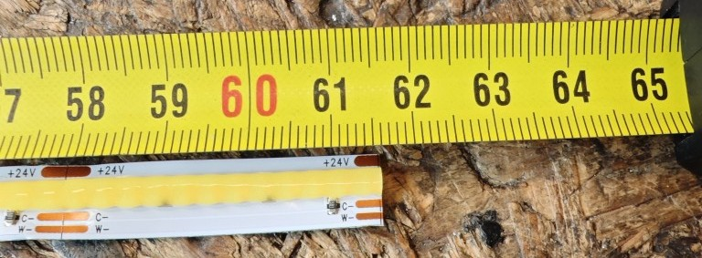

# HexaLED
Modular hexagon ceiling lights using 24 V CCT COB LED strips

## ToDo
- add photos
- add files (.step, gerber, YAML for ESPHome)
- hide the leftover wires

## Summary
I saw many of these "Hexagon LED" ceiling lights but none that would fit my needs:
- 24 V DC powered
- dimmable warm white / cold white (CCT)
- COB LEDs
- low profile
- able to be controlled locally via Home Assistant
- freely extendable / modular

## How it started / bill of materials
1. Controller: I first wanted to build a multi-channel N-FET driver board that would be able to control 10 output channels (for 5 CCT strips). Then I found out about these fancy thingies: [QuinLED An-Penta-Deca](https://quinled.info/quinled-an-penta-deca/) and [QuinLED An-Penta-Plus](https://quinled.info/quinled-an-penta-plus/). Well the first step was easy: add to cart 😂
2. Power supply: [ERPF-400-24 from MEAN WELL](https://www.tme.eu/si/en/details/erpf-400-24/led-power-supplies/mean-well/) looked ok for me with some extra power leftover.
3. LED strips: I decided on these: [AliExpress - FCOB CCT LED Light Strip 608 LEDs High Density Flexible FOB COB 10mm Led Lights RA90 2700K to 6000K Linear Dimmable DC24V](https://www.aliexpress.com/item/1005007162915201.html) - not an affiliate link. I went with 24 V type, I ordered 5 m long strips that I then cut into segments.
4. Cables: I wanted silicone cables so they are easier to bend. I ordered a bunch of these 3-pin ones: [10Pcs JST XH 2s Battery Balancing Charge Plug Silicone Wire JST XH Female Cable 200mm 22AWG for RC Parts](https://www.aliexpress.com/item/1005008182460220.html) - not an affiliate link either. I went with these: 2S 3pin 200mm -10Pcs.
5. I now needed some connectors where the cables will connect to. I ordered a bunch of S3B-XH-A-1 (LF)(SN) connectors from TME.eu: [TME.eu - S3B-XH-A-1 (LF)(SN)JST](https://www.tme.eu/si/en/details/s3b-xh-a-1/raster-signal-connectors-2-50mm/jst/s3b-xh-a-1-lf-sn/).
6. Oh right, I need something to mount LED strips to! Luckily my local hardware store has these 2 m long anodized aluminium profiles that are meant for LED strips, with diffusers. Neat! The thing is, I don't have a link where to buy them or any article numbers. I'll post photos with measurements down below.
7. How will I mount all this? Well the connectors need a PCB, so I made 2 simple designs and had it made by JLCPCB. The PCBs are 1 mm thick but are made from 4 layers. Top and bottom are 10 oz and both inside ones are 5 oz each so I connected both inner layers together. I only needed 3 layers anyway.
8. 3D printed parts hold everything fixed up on the ceiling. I used white PETG, nothing special. I did use up over 1 kg of it thouggh. Some parts were scrap (bad design) but I do want the lights to stay up for a long time :)
9. I also had a big issue of how am I going to align everything up on the ceiling correctly? I had my neighbor CNC cut a 3 mm thick aluminium jig that I used to mark all the holes with. I did need help of my sister for this - thanks sis :)
10. Other material that I used:
- M3x10 mm screws (DIN 912, 3 per cover),
- 2.9X4.5 DIN7981 screws for mounting LED profile to 3D printed base (2 per profile),
- [fischer Metal cavity fixing HM 5 x 37 S B polybag](https://www.fischer-international.com/en/products/cavity-fixings/board-fixing/metal-cavity-fixing-hm/48041-hm-5-x-37-s-b) drywall "anchors" (1 per base),
- 4 mm² wires for long runs and 0,75 mm wires for last 20 cm between distribution boards and long run cables,
- wire ferrules,
- WAGO inline splicing connectors with levers, 221 series (for connecting 4 mm² cables to 0,75 mm² cables - 3 per LED group).

## Long story short
After about 5 days worth of walking up and down my ladder, a lot of cutting and stripping wires, even more soldering and eventually figuring out I messed up the lengths again... I somehow made it!

I won't go in too many details why I made some decisions because that would take too long but trust me, be precise when cutting wires and mounting everything. This project is made so (poorly?) that it only has up to 2 mm tolerance on a segment before you're forced to make some wires longer or shorter or it just won't fit.

I decided to make 5 groups of 7 LED strips so the current is evenly distributed. I'm running them all in 2 groups right now, I'm waiting to get An-Penta-Deca delivered, then I'll be splitting them :)

## Important stuff
Here's a list of what measurements are important:
1. LED profiles need to be cut to 665 mm pieces
2. LED strips need to be 616 mm long (cut at cut marks, they are spot-on)
3. You need 2 length of cables: one that has straight wires needs to be XX mm long and the other that has crossed wires needs to be XX mm long.
4. LED profile covers/diffusers need to be 640 mm long
5. When soldering JST connectors to PCB, make sure to cut the legs before soldering so you get as low profile PCB as possible! I tried cutting/grinding them later but that takes waay more time.

## Build process
I hope I can explain in enough detail how to make this :)

### LED profiles
You need to cut the profiles to 665 mm pieces. Why 665? Well I got the profiles in 2 m length and it was the least amount of waste doing it this way.

I then went to work with angle grinders. First I cut the profiles then I used the 2nd grinder to deburr the edges a bit.

Manual file was used to reach inside parts of profile. I wanted to make all corners smooth, silicone wires are easily damaged!

I used a simple 3D printed jig to drill 3 mm holes in correct spot for all the profiles. Just make sure to clear out the debree every so often. I should've made the jig open from the bottom but.. Too late now :)

I made sure to have all edges nice and clean with no sharp edges.

Last step is to mark where the strips need to be placed. Don't hurry or it will bit you later. Ask me how I know. Mark a line 25 mm from edge.

### PCB soldering

The PCBs are really easy to solder, just keep in mind that you cut the connectors before soldering them!

Make sure all the solder joints are as flush as possible, there isn't a lot of free space that we're working with :)

You can use the jig that I also provided.

Power injection "nodes" are a bit of a pain in the butt to make, I admit. Note to self: don't ever order PCBs at 1 AM. Sleep it over and order the next morning. I later replaced the wires with longer (and slightly thicker) ones so I could hide them better.

### LED strips

Cut the strips at cut marks, my strips had them at about 616 mm

## Summary
I totally overengineered this but.. Oh man it looks nice 😅 Not to mention how much it eliminates shadows! Crazy. Would I do it again? Now that it's done, maybe. If you asked me 2 days before coming to this stage: not a chance!

Interesting info: at output of LED controller, I get 24,04 V and at end of strip that is farthest away, my voltemeter read 23,51 V. That is 0,53 V voltage drop and I think that's pretty good. Maybe I did go a bit overboard with using such thick wire for long runs but.. It is what it is. I'm not changing it now.

Anyway, feel free to download the files and make your own hexagon ceiling lights. Let me know if I forgot to add any details or if you have any questions. This is one of the first projects that I started with when moving to a new apartment.

The lights are set up in my "mancave": I call it "Brlog" - that translates to "den" or "lair" 😅

Hope you enjoyed reading this, it sure was an interesting project for me. Not to mention, this was the first time I had custom 4-layer PCBs made for me 😂

## License
This project is licensed under [CC BY-NC 4.0](https://creativecommons.org/licenses/by-nc/4.0/).  
You are free to use and remix it for **non-commercial purposes**, with attribution.  
⚠️ Provided as-is. No liability accepted.
